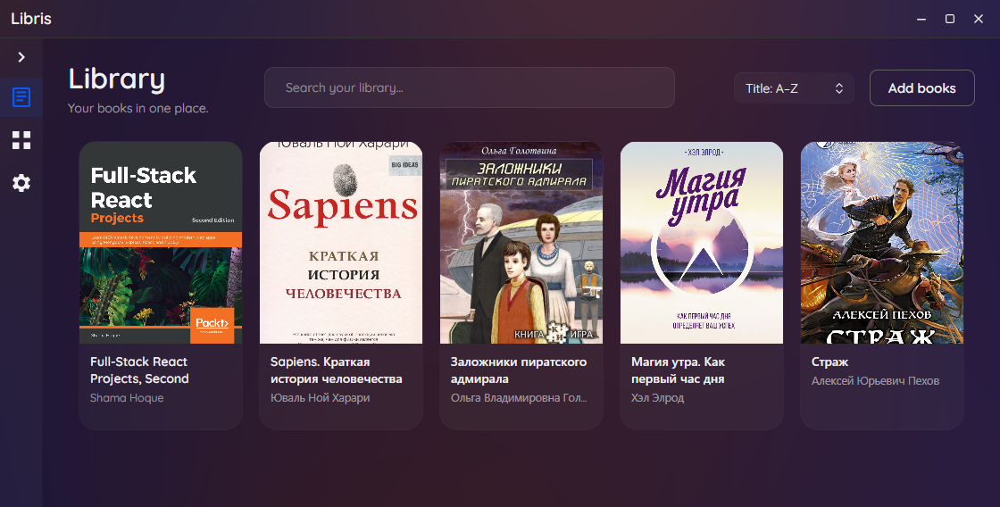
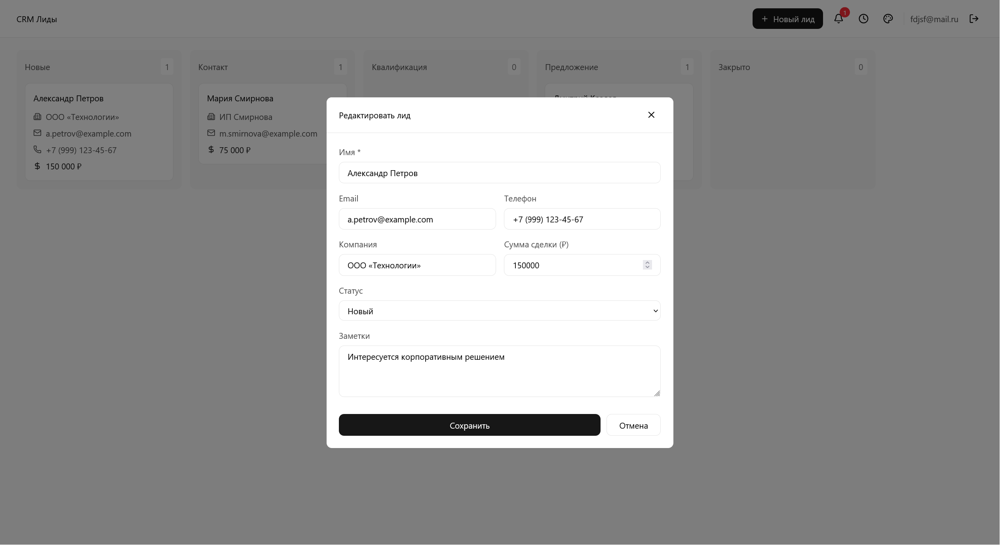
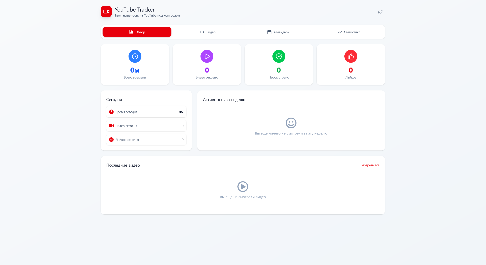

<h2>Building software with purpose</h2>

Full-stack developer focused on modern web applications, 
desktop software and clean, functional interfaces

&nbsp;

&nbsp;

## Selected Work

<table width="100%">
<tr>

<td width="50%" valign="top">

<h3>BodyOS</h3>

Personal workout planning, tracking, 
and progress system for bodyweight training.

<a href="https://github.com/TeGaLeX15/workhealth">
View repository →
</a>

</td>

<td width="50%" valign="top">

<h3>Libris</h3>

Modern desktop e-book reader built with C# and Avalonia UI,
designed for a clean and comfortable reading experience.

<a href="https://github.com/TeGaLeX15/libris">
View repository →
</a>

</td>

</tr>

<tr>

<td width="50%" valign="top">

<h3>CRM Minimum</h3>

Lightweight CRM for managing leads, customers, tasks,
and sales activities with a focus on simple workflows.

<a href="https://github.com/TeGaLeX15/crm-minimum">
View repository →
</a>

</td>

<td width="50%" valign="top">

<h3>YouTube Stats Tracker</h3>

Browser extension for tracking and analyzing YouTube activity,
with useful statistics and insights.

<a href="https://github.com/TeGaLeX15/ytstatstracker">
View repository →
</a>

</td>

</tr>
</table>

## Tech Stack

## GitHub Activity

PROFILE VISITORS

